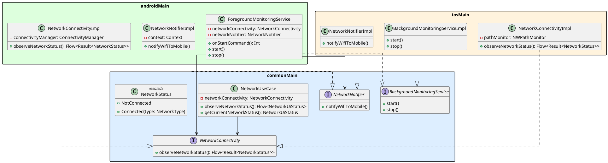

# バックグラウンドネットワーク監視 設計

## 概要

アプリをタスクキルした後もWiFi→モバイル回線の切り替えをリアルタイムに検知し、ユーザーへプッシュ通知を送る機能の設計。

## 技術選定

### なぜ Foreground Service か

Android 7以降、バックグラウンドアプリへの `CONNECTIVITY_CHANGE` ブロードキャストは無効化されている。
タスクキル後もリアルタイムに監視し続けるには Foreground Service 内で `ConnectivityManager.registerDefaultNetworkCallback` を保持し続けるしかない。

| 手段 | タスクキル後の生存 | リアルタイム性 | 通知の要否 |
|------|:-----------------:|:--------------:|:----------:|
| Foreground Service | ○ | ○ | 必須（最小化可能） |
| WorkManager | △（OS任せ） | × (最短15分) | 不要 |
| AlarmManager | △（Doze制限あり） | × | 不要 |
| BroadcastReceiver | × | ○ | 不要 |

## KMP 対応方針

将来的に iOS への対応を見据え、プラットフォーム固有の実装をインターフェースで抽象化する。

| 層 | 内容 | KMP モジュール |
|----|------|---------------|
| ビジネスロジック | `NetworkUseCase` | `commonMain` |
| 監視インターフェース | `NetworkConnectivity` | `commonMain` |
| 通知インターフェース | `NetworkNotifier` | `commonMain` |
| バックグラウンド実行インターフェース | `BackgroundMonitoringService` | `commonMain` |
| Android 実装 | `NetworkConnectivityImpl`, `NetworkNotifierImpl`, `ForegroundMonitoringService` | `androidMain` |
| iOS 実装 | `NetworkConnectivityImpl`, `NetworkNotifierImpl`, `BackgroundMonitoringServiceImpl` | `iosMain` |

`NetworkUseCase` はいずれのインターフェースにも依存させず、UI層へのデータ変換のみを担う。
通知のトリガー判定（Wifi→Mobile 検知）は `ForegroundMonitoringService` が担う。

## クラス図



## 実装メモ

### Foreground Service の常時通知について

Android 8以降、Foreground Service には通知チャンネルが必須。
ユーザー体験を損なわないよう、常時通知は最小化設定を推奨する。

```kotlin
NotificationChannel(
    CHANNEL_ID_MONITORING,
    "ネットワーク監視",
    NotificationManager.IMPORTANCE_MIN  // 通知バーの最下部に表示、音なし
)
```

WiFi→モバイル検知時の通知は別チャンネルで `IMPORTANCE_HIGH` に設定する。

### 状態遷移の検知

`ForegroundMonitoringService` 内で前回の状態を保持し、Wifi→Mobile の変化時のみ通知を発火する。

```kotlin
var previousStatus: NetworkStatus? = null

networkConnectivity.observeNetworkStatus().collect { result ->
    val current = result.getOrNull() ?: return@collect
    if (previousStatus is NetworkStatus.Connected(NetworkType.Wifi)
        && current is NetworkStatus.Connected(NetworkType.Mobile)) {
        networkNotifier.notifyWifiToMobile()
    }
    previousStatus = current
}
```
