# バックグラウンドネットワーク監視 設計

## 概要

アプリをタスクキルした後もWiFi→モバイル回線の切り替えをリアルタイムに検知し、ユーザーへプッシュ通知を送る機能の設計。

## 技術選定

### なぜ Foreground Service か

Android 7以降、バックグラウンドアプリへの `CONNECTIVITY_CHANGE` ブロードキャストは無効化されている。
タスクキル後もリアルタイムに監視し続けるには Foreground Service 内で `ConnectivityManager.registerDefaultNetworkCallback` を保持し続けるしかない。

| 手段 | タスクキル後の生存 | リアルタイム性 | 通知の要否 |
|------|:-----------------:|:--------------:|:----------:|
| Foreground Service | ○ | ○ | 必須（最小化可能） |
| WorkManager | △（OS任せ） | × (最短15分) | 不要 |
| AlarmManager | △（Doze制限あり） | × | 不要 |
| BroadcastReceiver | × | ○ | 不要 |

## KMP 対応方針

将来的に iOS への対応を見据え、プラットフォーム固有の実装をインターフェースで抽象化する。

| 層 | 内容 | KMP モジュール |
|----|------|---------------|
| ビジネスロジック | `NetworkUseCase` | `commonMain` |
| 監視インターフェース | `NetworkConnectivity` | `commonMain` |
| 通知発火インターフェース | `NetworkNotifier` | `commonMain` |
| 通知許可Repositoryインターフェース | `NotificationPermissionRepository` | `commonMain` |
| 通知Presenterインターフェース | `NetworkNotificationPresenter` | `commonMain` |
| 通知許可Presenterインターフェース | `NotificationPermissionPresenter` | `commonMain` |
| UI更新Presenterインターフェース | `NetworkStatusPresenter` | `commonMain` |
| バックグラウンド実行インターフェース | `BackgroundMonitoringService` | `commonMain` |
| 通知許可ユースケース | `NotificationPermissionUseCase` | `commonMain` |
| 監視Facade（StateFlow 公開） | `NetworkMonitor` | ネイティブ層（`:app` / 将来 iOS）。Flow を境界に露出するため共通化しない |
| Android 実装 | `NetworkConnectivityImpl`, `NetworkNotifierImpl`, `NotificationPermissionRepositoryImpl`, `ForegroundMonitoringService`, `ForegroundMonitoringServiceController` | `androidMain` |
| iOS 実装 | `NetworkConnectivityImpl`, `NetworkNotifierImpl`, `BackgroundMonitoringServiceImpl` | `iosMain` |

### Presenter パターンによる責務分離

`NetworkUseCase` は監視結果を直接返さず、Presenter を通じて外側へ通知する。通知と UI 更新の責務は2つの Presenter インターフェースに分離し、`NetworkMonitor` がそれらを実装して状態と副作用の橋渡しを担う。

| インターフェース | 実装者 | ライフサイクル |
|---|---|---|
| `NetworkNotificationPresenter` | `NetworkMonitor` | Application スコープの DI コンテナと同じ |
| `NetworkStatusPresenter` | `NetworkMonitor` | Application スコープの DI コンテナと同じ |

`NetworkUseCase` は `suspend observe(notificationPresenter, statusPresenter)` を提供し、呼び出し元が起動した coroutine の中で監視ループを実行する。UseCase 自身は coroutine を起動せず、`Job` も返さない。これにより、UseCase は状態値や実行制御を直接返さず、Presenter 経由の出力だけを担当する。

- **ForegroundMonitoringService**: `serviceScope.launch { networkMonitor.observe() }` で監視を開始する。`observeJob` を保持し、`onStartCommand()` の再配送や start の再実行で監視 callback が多重登録されないようにする。
- **NetworkMonitor**: `NetworkNotificationPresenter` / `NetworkStatusPresenter` を実装し、UseCase からの通知発火要求を `NetworkNotifierImpl` に委譲しつつ、UI 用の `StateFlow` を更新する。
- **NetworkViewModel**: UseCase を直接 observe せず、`NetworkMonitor.status` を UI 状態へ変換する。監視開始・停止は `NetworkMonitor.start()` / `stop()` を呼び、実際の FGS 制御は `BackgroundMonitoringService` に委譲する。

`ForegroundMonitoringServiceController` は `Context` を使って FGS を起動・停止する薄いラッパーであり、`BackgroundMonitoringService` インターフェースを実装する。

### 通知権限の責務分離

通知権限の状態判定は `NotificationPermissionUseCase` に分離する。UseCase は `NotificationPermissionRepository` から権限状態を取得し、必要に応じて `NotificationPermissionPresenter` 経由で UI に権限要求や Snackbar 表示を依頼する。

`NotificationPermissionRepository` は suspend API とし、Platform ごとの永続化・OS 権限確認を実装に閉じ込める。Android では `POST_NOTIFICATIONS` の許可状態、`NotificationManagerCompat.areNotificationsEnabled()`、過去に権限要求したかどうかを DataStore Preferences で管理する。

`NetworkViewModel` は `NotificationPermissionPresenter` を実装し、監視開始時に `NotificationPermissionUseCase.isMonitoringStartable()` を `viewModelScope` から呼び出す。権限ダイアログの結果は UI 操作の入力として `NotificationPermissionRequestResult` に変換し、`updateNotificationPermission(result)` から UseCase に渡す。

## クラス図

```plantuml
@startuml
skinparam packageStyle rectangle
skinparam linetype ortho

package "commonMain" #DDEEFF {
    interface NetworkConnectivity {
        +observeNetworkStatus(): Flow<Result<NetworkStatus>>
    }

    interface NetworkNotificationPresenter {
        +displayNotification()
    }

    interface NotificationPermissionPresenter {
        +requestNotificationPermission()
        +showNotificationPermissionRequired()
    }

    interface NetworkStatusPresenter {
        +onNetworkStatusUpdated(status: NetworkMonitoringStatus)
    }

    interface BackgroundMonitoringService {
        +start()
        +stop()
    }

    interface NotificationPermissionRepository {
        +getStatus(): NotificationPermissionStatus
        +recordPermissionDecision()
    }

    class NetworkUseCase {
        -networkConnectivity: NetworkConnectivity
        -timeSource: TimeSource
        +observe(notificationPresenter, statusPresenter)
    }

    class NotificationPermissionUseCase {
        -notificationPermissionRepository: NotificationPermissionRepository
        +isMonitoringStartable(presenter)
        +updateNotificationPermission(result, presenter)
    }

    class NetworkMonitor {
        -networkUseCase: NetworkUseCase
        -backgroundMonitoringService: BackgroundMonitoringService
        -isMonitoring: Boolean
        +status: StateFlow<NetworkMonitoringStatus?>
        +start()
        +stop()
        +observe()
    }

    class NetworkStatus <<sealed>> {
        +Connected(type: NetworkType)
        +NotConnected
    }

    class NetworkMonitoringStatus <<sealed>> {
        +Available(status: NetworkStatus)
        +Failed
    }

    NetworkUseCase --> NetworkConnectivity
    NetworkUseCase ..> NetworkNotificationPresenter
    NetworkUseCase ..> NetworkStatusPresenter
    NotificationPermissionUseCase --> NotificationPermissionRepository
    NotificationPermissionUseCase ..> NotificationPermissionPresenter
    NetworkMonitor ..|> NetworkNotificationPresenter
    NetworkMonitor ..|> NetworkStatusPresenter
    NetworkMonitor --> NetworkUseCase
    NetworkMonitor --> BackgroundMonitoringService
}

package "presentation" #E8E8FF {
    class NetworkViewModel {
        -networkMonitor: NetworkMonitor
        -notificationPermissionUseCase: NotificationPermissionUseCase
        +uiEffect: SharedFlow<NetworkUiEffect>
        +observeNetworkStatus()
        +updateNotificationPermission(result)
        +stopObserveNetworkStatus()
    }

    NetworkViewModel ..|> NotificationPermissionPresenter
    NetworkViewModel --> NetworkMonitor
    NetworkViewModel --> NotificationPermissionUseCase
}

package "androidMain" #DDFFDD {
    class NetworkConnectivityImpl {
        -connectivityManager: ConnectivityManager
        +observeNetworkStatus(): Flow<Result<NetworkStatus>>
    }

    class NetworkNotifierImpl {
        -context: Context
        +notifyWifiToMobile()
    }

    class NotificationPermissionRepositoryImpl {
        -context: Context
        -dataStore: DataStore<Preferences>
        +getStatus(): NotificationPermissionStatus
        +recordPermissionDecision()
    }

    class ForegroundMonitoringService {
        -networkMonitor: NetworkMonitor
        -observeJob: Job?
        +onStartCommand(): Int
    }

    class ForegroundMonitoringServiceController {
        -context: Context
        +start()
        +stop()
    }

    NetworkConnectivityImpl ..|> NetworkConnectivity
    NotificationPermissionRepositoryImpl ..|> NotificationPermissionRepository
    NetworkMonitor --> NetworkNotifierImpl
    ForegroundMonitoringService --> NetworkMonitor
    ForegroundMonitoringServiceController ..|> BackgroundMonitoringService
}

package "iosMain" #FFF3DD {
    class "NetworkConnectivityImpl" as iOSConnectivity {
        -pathMonitor: NWPathMonitor
        +observeNetworkStatus(): Flow<Result<NetworkStatus>>
    }

    class "NetworkNotifierImpl" as iOSNotifier {
        +notifyWifiToMobile()
    }

    class BackgroundMonitoringServiceImpl {
        -networkUseCase: NetworkUseCase
        +start()
        +stop()
        +displayNotification()
    }

    iOSConnectivity ..|> NetworkConnectivity
    BackgroundMonitoringServiceImpl ..|> BackgroundMonitoringService
    BackgroundMonitoringServiceImpl ..|> NetworkNotificationPresenter
    BackgroundMonitoringServiceImpl --> NetworkUseCase
    BackgroundMonitoringServiceImpl --> iOSNotifier
}
@enduml
```



## 実装メモ

### Android 13/14 (Target SDK 36) の制約と対応

1. **通知パーミッション（Android 13+ / API 33+）**
   - `POST_NOTIFICATIONS` 権限の許可はバックグラウンドでの通知表示に必要ですが、Foreground Service (FGS) 自体の起動・動作自体は通知権限がなくても実行可能です（その場合、通知は表示されません）。ただし、ユーザーにサービスの稼働を示すために、アプリ起動時または監視機能の有効化時に権限要求ダイアログを表示することが推奨されます。
   - 本実装ではアプリ起動直後には権限要求せず、監視開始時に `NotificationPermissionUseCase` が `NotificationPermissionStatus` を判定する。
   - `Requestable` の場合は `NotificationPermissionPresenter.requestNotificationPermission()` を呼び、`NetworkViewModel` が `NetworkUiEffect.RequestNotificationPermission` を emit する。Activity はこの effect を受けて permission launcher を起動する。
   - `RequiredButNotGranted` の場合、または権限要求結果が拒否だった場合は `NotificationPermissionPresenter.showNotificationPermissionRequired()` を呼び、Snackbar で通知許可が必要なことを表示する。
   - 過去に権限要求したかどうかは `NotificationPermissionRepositoryImpl` が DataStore Preferences に保存する。これにより初回の `Requestable` と、過去拒否済みの `RequiredButNotGranted` を区別する。

2. **Foreground Service Type の指定（Android 14+ / API 34+）**
   - Foreground Service の起動にあたり、マニフェストおよびコード内での `foregroundServiceType` の明示的な指定が必須。
   - 今回の「ネットワーク監視」は定義済みのどのカテゴリにも直接合致しないため、`specialUse` を使用する。
   - **AndroidManifest.xml への追加:**
     ```xml
     <uses-permission android:name="android.permission.FOREGROUND_SERVICE" />
     <uses-permission android:name="android.permission.FOREGROUND_SERVICE_SPECIAL_USE" />

     <service
         android:name=".platform.ForegroundMonitoringService"
         android:foregroundServiceType="specialUse"
         android:exported="false">
         <property
             android:name="android.app.PROPERTY_SPECIAL_USE_FGS_SUBTYPE"
             android:value="Network switching observer for notification" />
     </service>
     ```
   - **Service 起動時の指定（コード内）:**
     ```kotlin
     if (Build.VERSION.SDK_INT >= Build.VERSION_CODES.UPSIDE_DOWN_CAKE) {
         startForeground(
             NOTIFICATION_ID,
             notification,
             ServiceInfo.FOREGROUND_SERVICE_TYPE_SPECIAL_USE
         )
     } else {
         startForeground(NOTIFICATION_ID, notification)
     }
     ```

### Foreground Service の常時通知について

Android 8以降、Foreground Service には通知チャンネルが必須。
一方で `minSdk = 24` のため、`NotificationChannel` の作成と `startForegroundService()` の呼び出しは API 26 以上でのみ実行する。API 25 以下では通知チャンネルを作成せず、サービス起動には `startService()` を使う。
ユーザー体験を損なわないよう、常時通知は最小化設定を推奨する。

```kotlin
if (Build.VERSION.SDK_INT >= Build.VERSION_CODES.O) {
    NotificationChannel(
        CHANNEL_ID_MONITORING,
        "ネットワーク監視",
        NotificationManager.IMPORTANCE_MIN,  // 通知バーの最下部に表示、音なし
    )
}
```

WiFi→モバイル検知時の通知は別チャンネルで `IMPORTANCE_HIGH` に設定する。

### 状態遷移の検知ロジック

通知判定用の状態（`lastConnectedType` / `disconnectedTime`）は `observe()` 呼び出しごとのコルーチンローカル変数として保持する。UseCase インスタンスに状態を持たせず、監視 coroutine のライフサイクルに閉じる。

Android の `NetworkCallback` はネットワーク切り替え時に `onLost()` を挟むことがあり、`Wifi -> NotConnected -> Mobile` という順序で観測され得る（issue #8）。UI には全状態をそのまま渡しつつ、通知判定では切断からの経過時間が grace period（5秒）以内であれば実質的な `Wifi -> Mobile` 切り替えとして扱う。長時間オフライン後の Mobile 接続は誤通知を避けるため通知しない。

なお `observeNetworkStatus()` は `distinctUntilChanged` 済みのため、`Connected(Wifi)` は接続中に繰り返し流れず接続時の1回しか観測されない。そのため「最後に Connected を観測した時刻」ではなく「切断した時刻」（`disconnectedTime`）を grace 判定の基準にする。`disconnectedTime == null`（NotConnected を挟まない直接の切り替え）は無条件で grace 内として扱う。

時刻の取得は `kotlin.time.TimeSource` を注入して行う（既定は `TimeSource.Monotonic`、テストでは `TestTimeSource`）。`commonMain` 互換であり、壁時計のジャンプの影響も受けない。

```kotlin
suspend fun observe(
    notificationPresenter: NetworkNotificationPresenter,
    statusPresenter: NetworkStatusPresenter,
) {
    var lastConnectedType: NetworkStatus.NetworkType? = null
    var disconnectedTime: TimeMark? = null
    networkConnectivity.observeNetworkStatus().collect { result ->
        result.fold(
            onSuccess = { current ->
                when (current) {
                    is NetworkStatus.Connected -> {
                        val isShortInterruption =
                            disconnectedTime?.let { it.elapsedNow() <= WIFI_TO_MOBILE_GRACE } ?: true
                        if (lastConnectedType == NetworkStatus.NetworkType.Wifi &&
                            current.type == NetworkStatus.NetworkType.Mobile &&
                            isShortInterruption
                        ) {
                            notificationPresenter.displayNotification()
                        }
                        lastConnectedType = current.type
                        disconnectedTime = null
                    }
                    NetworkStatus.NotConnected -> {
                        if (disconnectedTime == null) {
                            disconnectedTime = timeSource.markNow()
                        }
                    }
                }
                statusPresenter.onNetworkStatusUpdated(NetworkMonitoringStatus.Available(current))
            },
            onFailure = {
                statusPresenter.onNetworkStatusUpdated(NetworkMonitoringStatus.Failed)
            },
        )
    }
}
```

| 遷移 | 通知 |
|------|:----:|
| `Wifi -> Mobile`（直接） | ○ |
| `Wifi -> NotConnected(grace 内) -> Mobile` | ○ |
| `Wifi -> NotConnected(grace 超過) -> Mobile` | × |
| `Mobile -> NotConnected -> Mobile` | × |
| 接続歴なし `-> Mobile` | × |
| 通知後の `Mobile -> NotConnected -> Mobile` | ×（再通知しない） |

監視 coroutine の `Job` は UseCase ではなく Platform 側が保持する。Android では FGS の `onStartCommand()` が複数回呼ばれる可能性があるため、`observeJob` で多重起動を防ぐ。

```kotlin
if (observeJob?.isActive != true) {
    observeJob = serviceScope.launch {
        networkMonitor.observe()
    }
}
```

### iOS 側のバックグラウンド動作への対応（将来）

iOS ではセキュリティと省電力の制限により、バックグラウンドでのリアルタイム監視（常時ソケット接続や常時ポーリングなど）は不可能です。
そのため、`BackgroundMonitoringServiceImpl` の iOS 側の実装では以下のハイブリッドアプローチを想定します。

1. **フォアグラウンド時**: `NWPathMonitor` を利用してリアルタイムにネットワーク変更を監視。
2. **バックグラウンド時**: `BGTaskScheduler`（Background Tasks）を用いて、OSが許可したバックグラウンド実行タイミング（最短で十数分〜数時間間隔）で現在のネットワーク状態を取得。
3. **状態永続化**: アプリのプロセスがバックグラウンドタスク実行時に都度新しく起動するため、前回のネットワーク状態を `NSUserDefaults`（KMP では `Settings` ライブラリ等）に保存し、バックグラウンドタスク起動時に前回の値と比較して WiFi→モバイル の遷移を検知・ローカル通知を発火する。
