# バックグラウンドネットワーク監視 設計

## 概要

アプリをタスクキルした後もWiFi→モバイル回線の切り替えをリアルタイムに検知し、ユーザーへプッシュ通知を送る機能の設計。

## 技術選定

### なぜ Foreground Service か

Android 7以降、バックグラウンドアプリへの `CONNECTIVITY_CHANGE` ブロードキャストは無効化されている。
タスクキル後もリアルタイムに監視し続けるには Foreground Service 内で `ConnectivityManager.registerDefaultNetworkCallback` を保持し続けるしかない。

| 手段 | タスクキル後の生存 | リアルタイム性 | 通知の要否 |
|------|:-----------------:|:--------------:|:----------:|
| Foreground Service | ○ | ○ | 必須（最小化可能） |
| WorkManager | △（OS任せ） | × (最短15分) | 不要 |
| AlarmManager | △（Doze制限あり） | × | 不要 |
| BroadcastReceiver | × | ○ | 不要 |

## KMP 対応方針

将来的に iOS への対応を見据え、プラットフォーム固有の実装をインターフェースで抽象化する。

| 層 | 内容 | KMP モジュール |
|----|------|---------------|
| ビジネスロジック | `NetworkUseCase` | `commonMain` |
| 監視インターフェース | `NetworkConnectivity` | `commonMain` |
| 通知インターフェース | `NetworkNotifier` | `commonMain` |
| バックグラウンド実行インターフェース | `BackgroundMonitoringService` | `commonMain` |
| Android 実装 | `NetworkConnectivityImpl`, `NetworkNotifierImpl`, `ForegroundMonitoringService` | `androidMain` |
| iOS 実装 | `NetworkConnectivityImpl`, `NetworkNotifierImpl`, `BackgroundMonitoringServiceImpl` | `iosMain` |

`NetworkUseCase` は `NetworkConnectivity` と `NetworkNotifier` に依存し、監視ストリームの提供、状態遷移（WiFi → モバイル）の検知、および通知のトリガー処理をストリーム演算子（`onEach`）内で一元的に行います。
バックグラウンド監視の開始・停止は `NetworkViewModel#observeNetworkStatus()` / `NetworkViewModel#stopObserveNetworkStatus()` から `BackgroundMonitoringService` を介して行います。
`ForegroundMonitoringService` / `BackgroundMonitoringServiceImpl` は、データソースや通知の仕組みに直接依存せず、`NetworkUseCase` の監視ストリームを単に `collect()` してバックグラウンド実行を維持するだけの「薄いラッパー（殻）」として動作します。

## クラス図

```plantuml
@startuml
skinparam packageStyle rectangle
skinparam linetype ortho

package "commonMain" #DDEEFF {
    interface NetworkConnectivity {
        +observeNetworkStatus(): Flow<Result<NetworkStatus>>
    }

    interface NetworkNotifier {
        +notifyWifiToMobile()
    }

    interface BackgroundMonitoringService {
        +start()
        +stop()
    }

    class NetworkUseCase {
        -networkConnectivity: NetworkConnectivity
        -networkNotifier: NetworkNotifier
        -previousStatus: NetworkStatus
        +observeNetworkStatus(): Flow<NetworkUiStatus>
        +getCurrentNetworkStatus(): NetworkUiStatus
    }

    class NetworkStatus <<sealed>> {
        +Connected(type: NetworkType)
        +NotConnected
    }

    NetworkUseCase --> NetworkConnectivity
    NetworkUseCase --> NetworkNotifier
}

package "presentation" #E8E8FF {
    class NetworkViewModel {
        -networkUseCase: NetworkUseCase
        -backgroundMonitoringService: BackgroundMonitoringService
        +observeNetworkStatus()
        +stopObserveNetworkStatus()
    }

    NetworkViewModel --> NetworkUseCase
    NetworkViewModel --> BackgroundMonitoringService
}

package "androidMain" #DDFFDD {
    class NetworkConnectivityImpl {
        -connectivityManager: ConnectivityManager
        +observeNetworkStatus(): Flow<Result<NetworkStatus>>
    }

    class NetworkNotifierImpl {
        -context: Context
        +notifyWifiToMobile()
    }

    class ForegroundMonitoringService {
        -networkUseCase: NetworkUseCase
        +onStartCommand(): Int
        +start()
        +stop()
    }

    NetworkConnectivityImpl ..|> NetworkConnectivity
    NetworkNotifierImpl ..|> NetworkNotifier
    ForegroundMonitoringService ..|> BackgroundMonitoringService
    ForegroundMonitoringService --> NetworkUseCase
}

package "iosMain" #FFF3DD {
    class "NetworkConnectivityImpl" as iOSConnectivity {
        -pathMonitor: NWPathMonitor
        +observeNetworkStatus(): Flow<Result<NetworkStatus>>
    }

    class "NetworkNotifierImpl" as iOSNotifier {
        +notifyWifiToMobile()
    }

    class BackgroundMonitoringServiceImpl {
        -networkUseCase: NetworkUseCase
        +start()
        +stop()
    }

    iOSConnectivity ..|> NetworkConnectivity
    iOSNotifier ..|> NetworkNotifier
    BackgroundMonitoringServiceImpl ..|> BackgroundMonitoringService
    BackgroundMonitoringServiceImpl --> NetworkUseCase
}
@enduml
```



## 実装メモ

### Android 13/14 (Target SDK 36) の制約と対応

1. **通知パーミッション（Android 13+ / API 33+）**
   - `POST_NOTIFICATIONS` 権限の許可はバックグラウンドでの通知表示に必要ですが、Foreground Service (FGS) 自体の起動・動作自体は通知権限がなくても実行可能です（その場合、通知は表示されません）。ただし、ユーザーにサービスの稼働を示すために、アプリ起動時または監視機能の有効化時に権限要求ダイアログを表示することが推奨されます。

2. **Foreground Service Type の指定（Android 14+ / API 34+）**
   - Foreground Service の起動にあたり、マニフェストおよびコード内での `foregroundServiceType` の明示的な指定が必須。
   - 今回の「ネットワーク監視」は定義済みのどのカテゴリにも直接合致しないため、`specialUse` を使用する。
   - **AndroidManifest.xml への追加:**
     ```xml
     <uses-permission android:name="android.permission.FOREGROUND_SERVICE" />
     <uses-permission android:name="android.permission.FOREGROUND_SERVICE_SPECIAL_USE" />

     <service
         android:name=".platform.ForegroundMonitoringService"
         android:foregroundServiceType="specialUse"
         android:exported="false">
         <property
             android:name="android.app.PROPERTY_SPECIAL_USE_FGS_SUBTYPE"
             android:value="Network switching observer for notification" />
     </service>
     ```
   - **Service 起動時の指定（コード内）:**
     ```kotlin
     if (Build.VERSION.SDK_INT >= Build.VERSION_CODES.UPSIDE_DOWN_CAKE) {
         startForeground(
             NOTIFICATION_ID,
             notification,
             ServiceInfo.FOREGROUND_SERVICE_TYPE_SPECIAL_USE
         )
     } else {
         startForeground(NOTIFICATION_ID, notification)
     }
     ```

### Foreground Service の常時通知について

Android 8以降、Foreground Service には通知チャンネルが必須。
ユーザー体験を損なわないよう、常時通知は最小化設定を推奨する。

```kotlin
NotificationChannel(
    CHANNEL_ID_MONITORING,
    "ネットワーク監視",
    NotificationManager.IMPORTANCE_MIN  // 通知バーの最下部に表示、音なし
)
```

WiFi→モバイル検知時の通知は別チャンネルで `IMPORTANCE_HIGH` に設定する。

### 状態遷移の検知ロジック

状態変化（Wifi → Mobile）のトリガー判定ロジックは、将来的なKMP共通化を見据えて `commonMain` 側のユースケースや監視エンジンに持たせることが望ましい。

```kotlin
var previousStatus: NetworkStatus? = null

fun observeNetworkStatus(): Flow<Result<NetworkStatus>> {
    return networkConnectivity.observeNetworkStatus()
        .onEach { result ->
            val current = result.getOrNull() ?: return@onEach
            val previous = previousStatus
            
            if (previous is NetworkStatus.Connected && previous.type == NetworkStatus.NetworkType.Wifi
                && current is NetworkStatus.Connected && current.type == NetworkStatus.NetworkType.Mobile) {
                networkNotifier.notifyWifiToMobile()
            }
            previousStatus = current
        }
}
```

### iOS 側のバックグラウンド動作への対応（将来）

iOS ではセキュリティと省電力の制限により、バックグラウンドでのリアルタイム監視（常時ソケット接続や常時ポーリングなど）は不可能です。
そのため、`BackgroundMonitoringService` の iOS 側の実装では以下のハイブリッドアプローチを想定します。

1. **フォアグラウンド時**: `NWPathMonitor` を利用してリアルタイムにネットワーク変更を監視。
2. **バックグラウンド時**: `BGTaskScheduler`（Background Tasks）を用いて、OSが許可したバックグラウンド実行タイミング（最短で十数分〜数時間間隔）で現在のネットワーク状態を取得。
3. **状態永続化**: アプリのプロセスがバックグラウンドタスク実行時に都度新しく起動するため、前回のネットワーク状態を `NSUserDefaults`（KMP では `Settings` ライブラリ等）に保存し、バックグラウンドタスク起動時に前回の値と比較して WiFi→モバイル の遷移を検知・ローカル通知を発火する。
