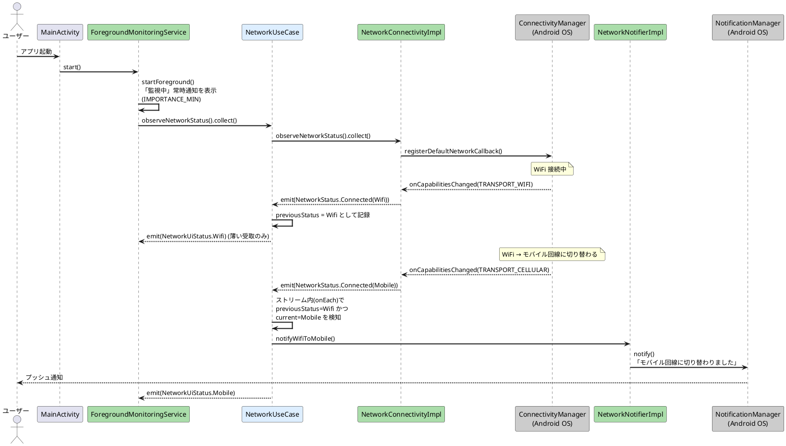
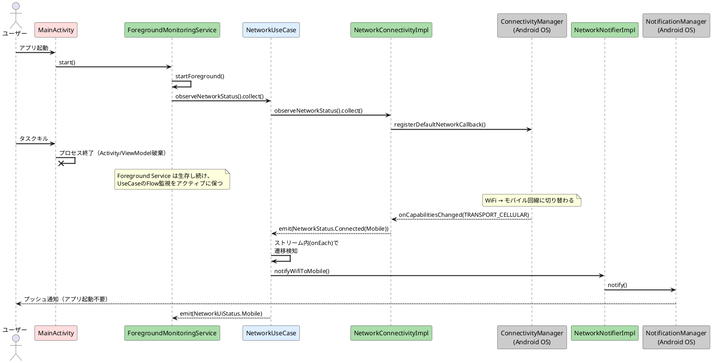
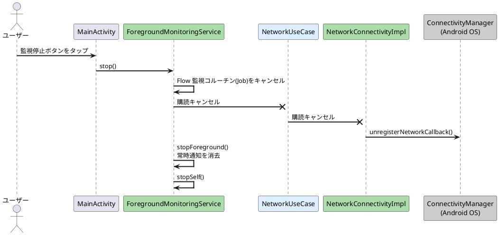

# WiFi→モバイル通知 シーケンス図

## 通常フロー（アプリ起動〜通知発火）

```plantuml
@startuml
skinparam sequenceArrowThickness 2
skinparam roundcorner 5

actor ユーザー
participant "MainActivity" as Activity
participant "ForegroundMonitoringService" as Service #AADDAA
participant "NetworkUseCase" as UseCase #DDEEFF
participant "NetworkConnectivityImpl" as Connectivity #AADDAA
participant "ConnectivityManager\n(Android OS)" as OS #CCCCCC
participant "NetworkNotifierImpl" as Notifier #AADDAA
participant "NotificationManager\n(Android OS)" as NotifOS #CCCCCC

ユーザー -> Activity: アプリ起動
Activity -> Service: start()
Service -> Service: startForeground()\n「監視中」常時通知を表示\n(IMPORTANCE_MIN)
Service -> UseCase: observeNetworkStatus().collect()
UseCase -> Connectivity: observeNetworkStatus().collect()
Connectivity -> OS: registerDefaultNetworkCallback()

note over OS: WiFi 接続中

OS --> Connectivity: onCapabilitiesChanged(TRANSPORT_WIFI)
Connectivity --> UseCase: emit(NetworkStatus.Connected(Wifi))
UseCase -> UseCase: previousStatus = Wifi として記録
UseCase --> Service: emit(NetworkUiStatus.Wifi) (薄い受取のみ)

note over OS: WiFi → モバイル回線に切り替わる

OS --> Connectivity: onCapabilitiesChanged(TRANSPORT_CELLULAR)
Connectivity --> UseCase: emit(NetworkStatus.Connected(Mobile))

UseCase -> UseCase: ストリーム内(onEach)で\npreviousStatus=Wifi かつ\ncurrent=Mobile を検知
UseCase -> Notifier: notifyWifiToMobile()
Notifier -> NotifOS: notify()\n「モバイル回線に切り替わりました」
NotifOS --> ユーザー: プッシュ通知
UseCase --> Service: emit(NetworkUiStatus.Mobile)
@enduml
```

## タスクキル後のフロー

```plantuml
@startuml
skinparam sequenceArrowThickness 2
skinparam roundcorner 5

actor ユーザー
participant "MainActivity" as Activity #FFDDDD
participant "ForegroundMonitoringService" as Service #AADDAA
participant "NetworkUseCase" as UseCase #DDEEFF
participant "NetworkConnectivityImpl" as Connectivity #AADDAA
participant "ConnectivityManager\n(Android OS)" as OS #CCCCCC
participant "NetworkNotifierImpl" as Notifier #AADDAA
participant "NotificationManager\n(Android OS)" as NotifOS #CCCCCC

ユーザー -> Activity: アプリ起動
Activity -> Service: start()
Service -> Service: startForeground()
Service -> UseCase: observeNetworkStatus().collect()
UseCase -> Connectivity: observeNetworkStatus().collect()
Connectivity -> OS: registerDefaultNetworkCallback()

ユーザー -> Activity: タスクキル
Activity ->x Activity: プロセス終了（Activity/ViewModel破棄）
note over Service: Foreground Service は生存し続け、\nUseCaseのFlow監視をアクティブに保つ

note over OS: WiFi → モバイル回線に切り替わる

OS --> Connectivity: onCapabilitiesChanged(TRANSPORT_CELLULAR)
Connectivity --> UseCase: emit(NetworkStatus.Connected(Mobile))

UseCase -> UseCase: ストリーム内(onEach)で\n遷移検知
UseCase -> Notifier: notifyWifiToMobile()
Notifier -> NotifOS: notify()
NotifOS --> ユーザー: プッシュ通知（アプリ起動不要）
UseCase --> Service: emit(NetworkUiStatus.Mobile)
@enduml
```

## 停止フロー

```plantuml
@startuml
skinparam sequenceArrowThickness 2
skinparam roundcorner 5

actor ユーザー
participant "MainActivity" as Activity
participant "ForegroundMonitoringService" as Service #AADDAA
participant "NetworkUseCase" as UseCase #DDEEFF
participant "NetworkConnectivityImpl" as Connectivity #AADDAA
participant "ConnectivityManager\n(Android OS)" as OS #CCCCCC

ユーザー -> Activity: 監視停止ボタンをタップ
Activity -> Service: stop()
Service -> Service: Flow 監視コルーチン(Job)をキャンセル
Service ->x UseCase: 購読キャンセル
UseCase ->x Connectivity: 購読キャンセル
Connectivity -> OS: unregisterNetworkCallback()
Service -> Service: stopForeground()\n常時通知を消去
Service -> Service: stopSelf()
@enduml
```
