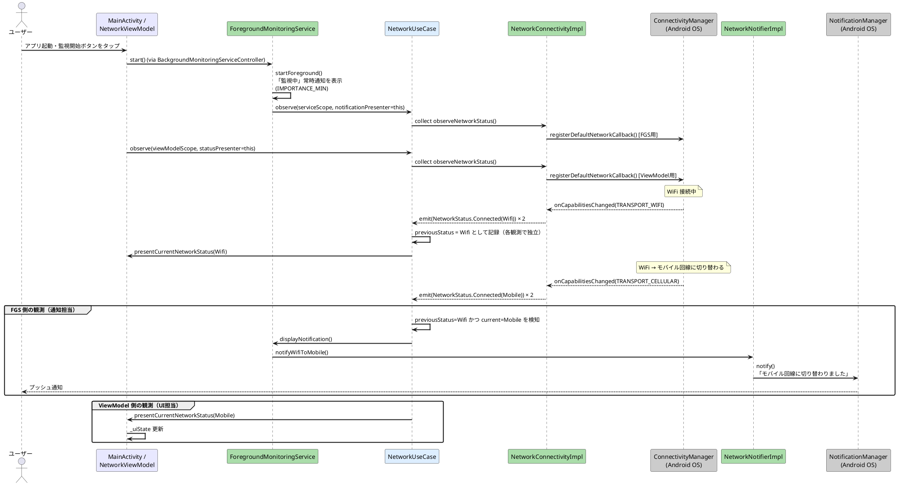
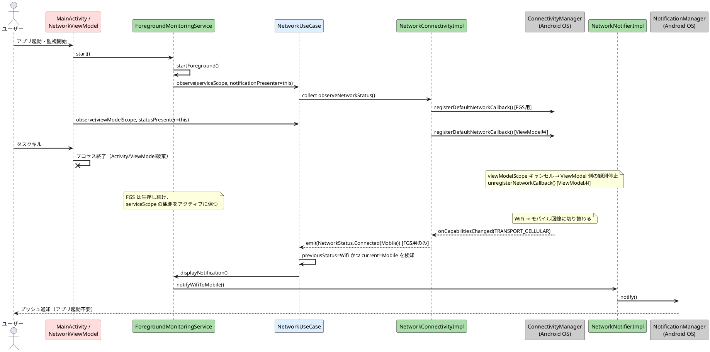
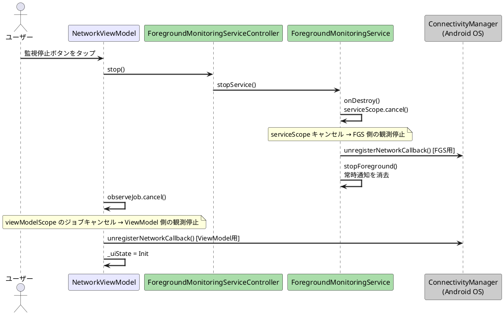

# WiFi→モバイル通知 シーケンス図

## 通常フロー（アプリ起動〜通知発火）

FGS と ViewModel はそれぞれ独立して `NetworkUseCase.observe()` を呼ぶ。FGS は通知発火を担い、ViewModel は UI 更新を担う。

## タスクキル後のフロー

ViewModel は破棄されるが FGS は生存し続けるため、FGS 側の観測が通知を発火する。

## 停止フロー

