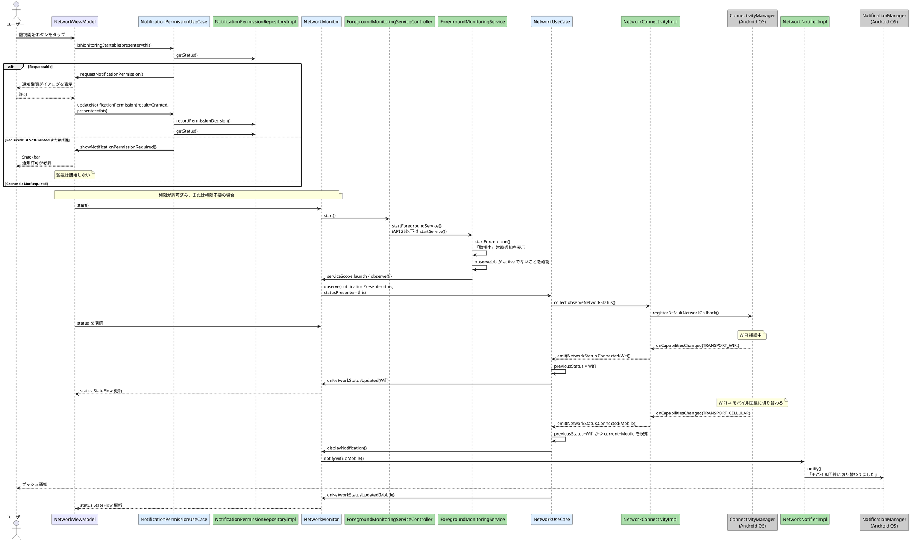
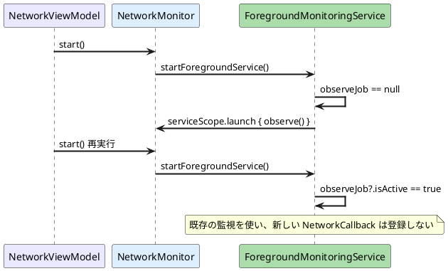
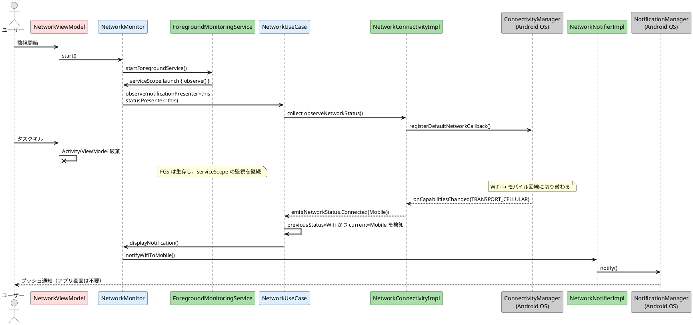
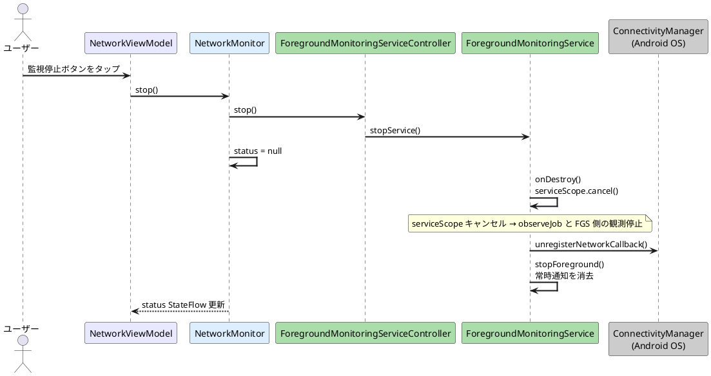

# WiFi→モバイル通知 シーケンス図

## 通常フロー（アプリ起動〜通知発火）

`NetworkViewModel` は `NetworkUseCase` を直接 observe しない。UI は `NetworkMonitor.status` を購読し、監視開始・停止だけを `NetworkMonitor` に依頼する。

FGS は `serviceScope` 上で `NetworkMonitor.observe()` を起動する。`NetworkMonitor` は `NetworkNotificationPresenter` / `NetworkStatusPresenter` として `NetworkUseCase` に渡され、UseCase からの通知要求と状態更新を受け取る。

## 多重起動防止フロー

`startForegroundService()` はサービス起動済みでも `onStartCommand()` を再度呼ぶため、FGS 側で監視 coroutine の `Job` を保持して多重登録を防ぐ。

## タスクキル後のフロー

ViewModel は破棄されるが、FGS とその `serviceScope` が生存している限り監視は継続する。UseCase の出力先は `NetworkMonitor` なので、UI が存在しない状態でも通知は発火できる。

## 停止フロー

